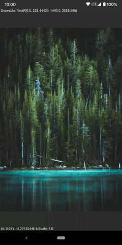
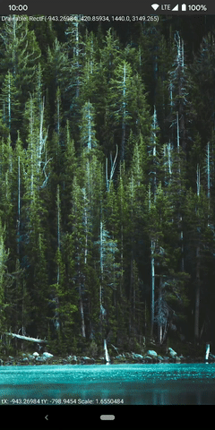

# ZoomImageView

A custom ImageView Implementation

Supports
- Double-tap to zoom
- Pinch zoom
- Drag to pan

&nbsp;&nbsp;

&nbsp;&nbsp;

## Planned improvements and future additions

- Fling support
- Swipe to dismiss

## Credits
Huge thanks to [Chris Banes](https://chris.banes.dev) for his [PhotoView library](https://github.com/chrisbanes/PhotoView) 

[Casey Horner](https://unsplash.com/@mischievous_penguins) for this photo on [unsplash](https://unsplash.com/photos/1sim8ojvCbE?utm_source=twitter&utm_medium=referral&utm_content=photos-page-share)

[Coil lib](https://coil-kt.github.io/coil/)
 
## License and usage

Feel free to use this file in your code. Just download and add to your project
